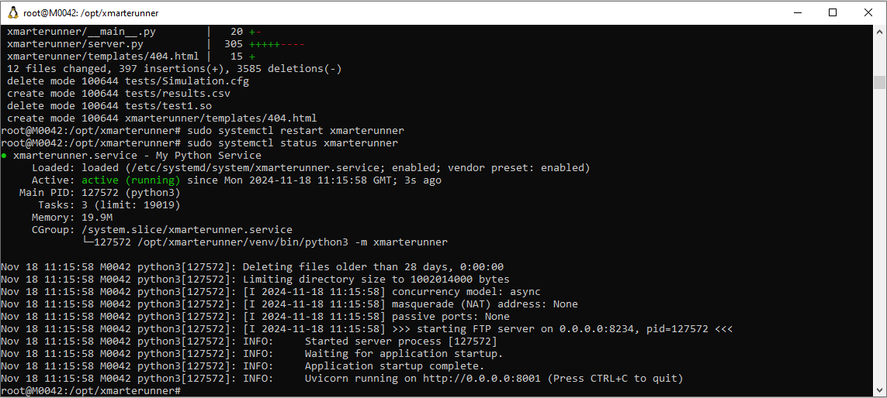
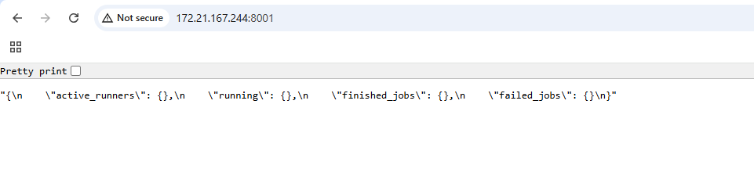
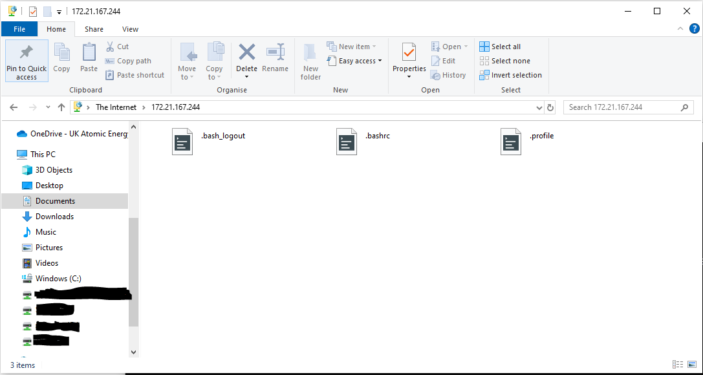

Debugging
#########

When debugging, you first want to confirm that your service is running, you can do this via:

.. code::
   
    sudo systemctl status xmarterunner

You can get more information from status with the journal entry:

.. code::

    journalctl -xeu xmarterunner.service

If the service is running, the next step is to figure out if the right port is being used an accessible for the HTTP instance. The easiest way to do this is to enter the service address following by port into your web browser.
You should receive a response giving a brief output about the current status of runner.

.. note:: For WSL instances running on Windows you will need to enter the IP Address from WSL when you run ifconfig that is set to eth0.

If this is running well, next you should check that you have FTP Access, you can use Windows Explorer or tools lik FileZilla to achieve this.

.. note:: If your issue is more that you are receiving errors from executing a MARTe2 configuration, this is more likely a result of the environment not containing a needed GAM/DataSource or your configuration being incorrect. Investigate first if you can run the configuration in another environment.