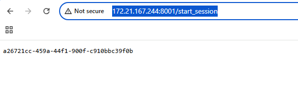
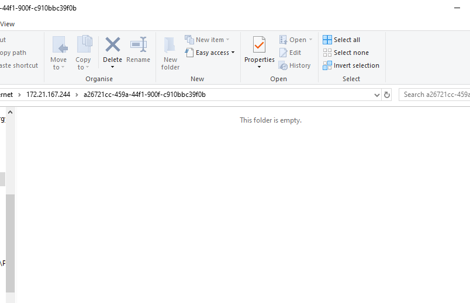
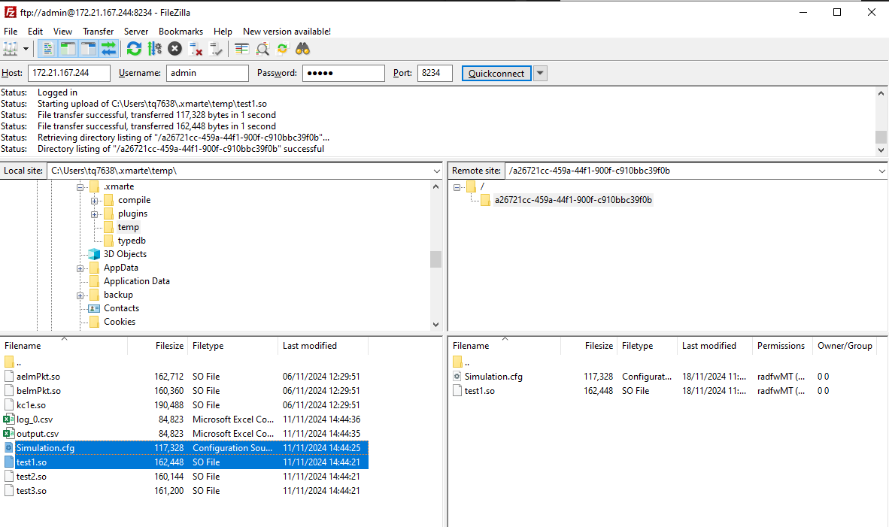
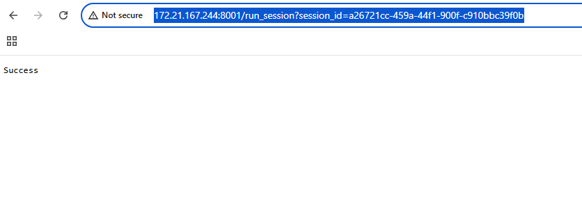
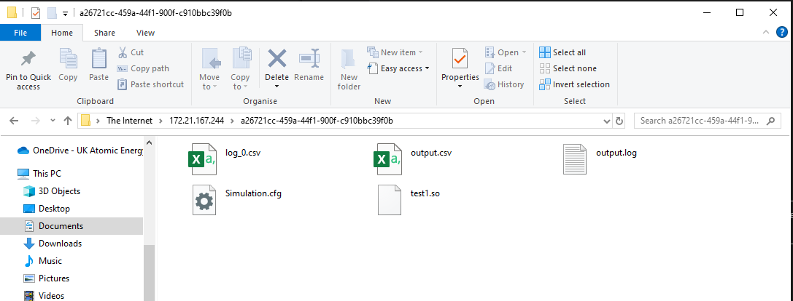

Usage
#####

The expected usage of this service is through python to execute automated builds and automate the following steps.

However for purposes of this explanation we shall show manually executing a configuration through the web browser and windows explorer.

The steps to run an execution are:
- Start a session with the service via HTTP
- Load your MARTe2 files to the session directory
- Execute the test
- Retrieve the results

To start a session with the HTTP instance, send it the REST API command start_session:

The server returns the session instance.

Now the FTP Folder contains a folder for our session to use:

.. note:: Windows Explorer doesn't request authentication which is required to place and get files so you should now switch to another tool like FileZilla so you can login.

  
Transfer your files across, your cfg file must be named Simulation.cfg and you must provide any supporting files such as CSV input files or libraries of types used.

Next execute the test by sending the REST command run_session with the session id:

Once the test is completed, you will be able to retrieve the output log files from the server:

